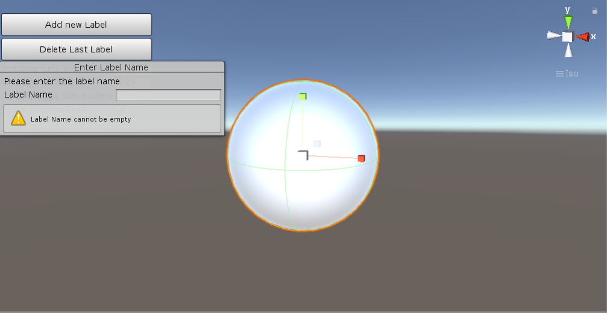
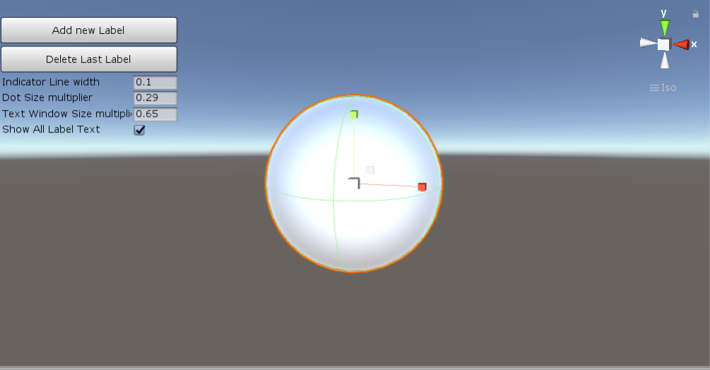
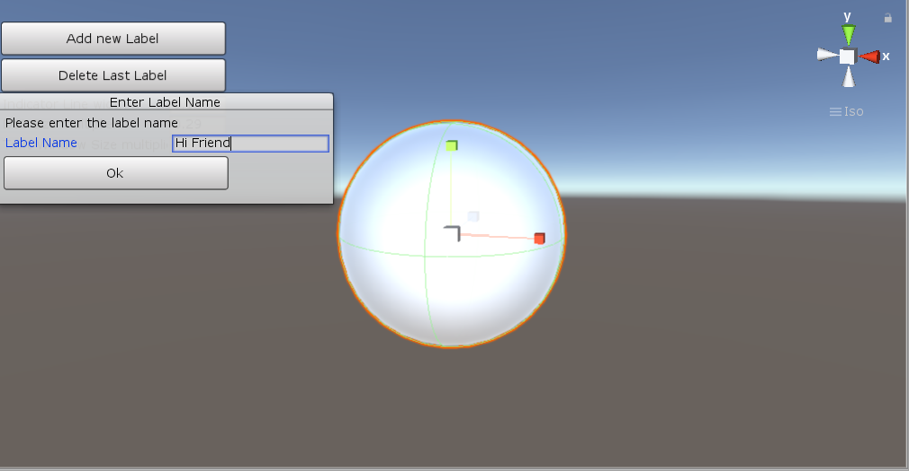
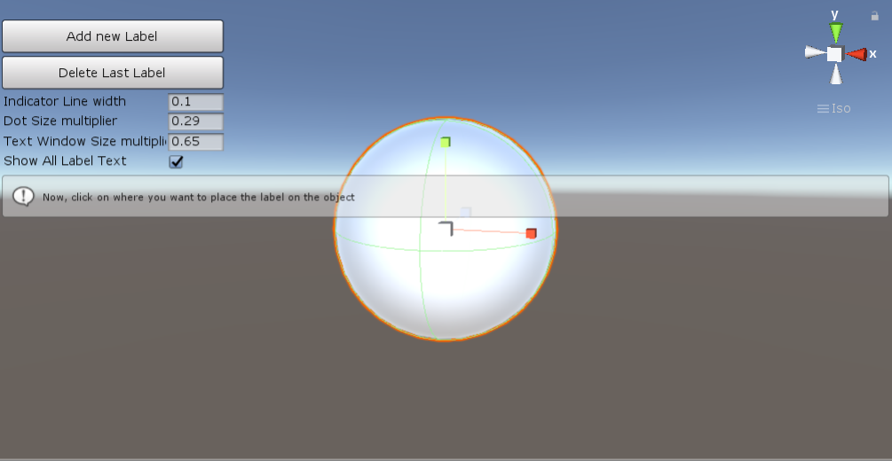
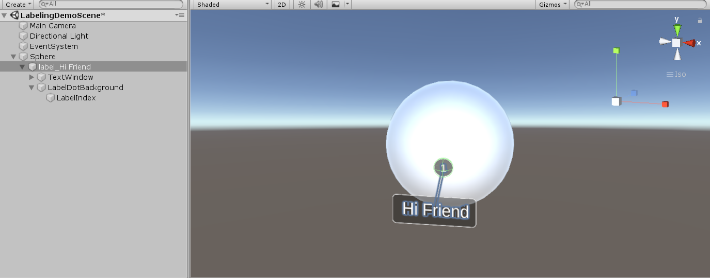
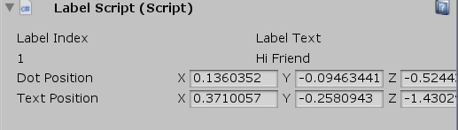

# Unity Annotation Label Maker
 annotation labelling tool for unity
## Project Description
**Unity Version:** 2018.3.0f2

**Last Update:** 03/18/2020

The Tool is made for artist/developer to quickly add annotation label onto a 3D object.

## Getting started
### Setting up
 1. Open project, import the 3D object into a scene and adjust the object size.
 2. Select the object -> Add Component -> Add "Label Script"
 
 3. After Adding the script, now when you select the object, following UI will pop up on Scene view.
 
### Add new label
 1. Adjust the scene, so that the area where the label needs to be placed can be seen in the scene view.
 2. Click on Add new Label to add label.
 3. A window will pop up asking for the label name, label name will displayed on the object after created, so it cannot be empty
 
 
 4. Click on OK button when the label name is entered
  
 
 5. Click on the area where the label needs to be placed 
 
 
 6. Label is created automatically
 

   *Number on the label dot increment automatically*
  ### Making Changes
   #### Deleting label
   click ***deleting last label button*** to delete last added label
   #### change size of labels
   change value of ***indicator line width*** to change width of the indicator line
   change value of ***Dot Size multiplier*** to change the label dot size
   change value of ***Text window Size multiplier*** to change the size of text window which displays the label name
   #### Show All label Text
   if ***show All label Text*** is checked, label names will be displayed, otherwise, they will be hidden
   #### Change position of labels and label text
   There are two ways of changing position of labels:
   1. select label object under the 3d object, select "TextWindow" or "LabelDotBackground" in the children and move them directly
   
   2. Or select the 3d object, on the Inspector window, the label script list out all the labels and the location of label dot and    text, make change to the number directly to change their position
   

   ### Access value through Script
   To turn on or off all label text use following code `object.GetComonent<LabelScript>().showAllLabelText(bool onOrOff)`

   To turn on or off label text of specific label text use following code `labelObject.GetComponent<LabelTextManager>().toggleText()` or `labelObject.GetComponent<LabelTextManager>().showText(bool onOrOff)`
   ### Other Functionalities
   The label will always facing main camera, indicator line will automatically connect between label dot and text.
   ### Debugging
   If error occurs, try remove all labels and reset the label script component.
   ## Additional Info
   For questions/suggestions, please contact me at silver.xu@Outlook.com.

  **Hope this is helpful!**
